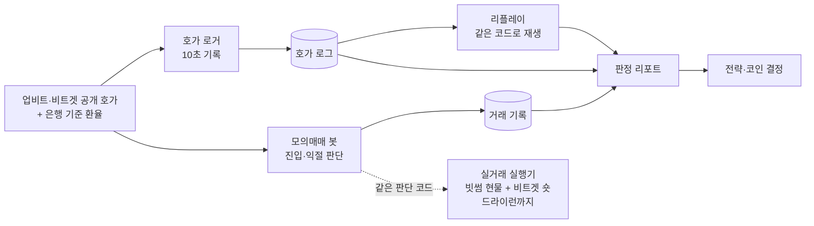

# 김치프리미엄 차익거래 시스템

국내 거래소 현물 매수와 해외 거래소(비트겟) 선물 공매도를 같은 수량으로 걸어 가격 방향 위험을 없애고,
두 시장의 가격 차이(김치프리미엄, 김프)가 움직이는 만큼만 취하는 **델타 중립 차익거래 시스템**이다.
**현재 모의매매 단계이고, 수익은 아직 증명되지 않았다.**

---

## 핵심 발견 3가지

### 1. 체결가 착시: 기록상 월 +27%가 호가를 반영하면 월 −37%

초기 모의매매는 손익을 마지막 체결가로 계산했다. 체결가는 매수호가와 매도호가 사이를 오가므로,
김프가 그대로여도 체결가가 호가 한쪽에서 반대쪽으로 옮겨 가기만 하면 익절이 찍힌다.

- 31일 기록 **14,470건**: 기록상 **월 +27.08%**, 실측 호가 스프레드를 반영하면 **월 −37.37%**(추정). 10개 코인 모두 적자였다
- 코인별 '60초 안에 익절된 비율'과 왕복 호가비용의 상관계수는 **0.86**이다. 스프레드가 넓은 코인일수록 가짜 익절이 많았다
- 조치: 진입·청산·익절 판단을 모두 실제 매수·매도호가 기준으로 바꾸고, 호가 로거를 만들어 기록을 처음부터 다시 쌓았다

### 2. 익절 신호의 환율 오염

봇은 청산 김프를 '지금' 은행 환율로 다시 계산해 익절 여부를 판단했다.
국내·해외 가격 변화율을 a·b, 은행 환율 변화율을 φ, 청산 때 국내 USDT 가격 ÷ 진입 때 은행 환율을 γ 라 하면,
헤지 포지션의 실제 손익은 P/K = (a−1) − γ(b−1) ≈ a − b 인데 봇이 본 값은 ≈ (a − b) − (φ − 1) 이라 환율 변화가 오차로 그대로 섞인다.

- 익절 **235건 중 74건**이 수수료를 빼면 적자였다 (환율이 0.3% 넘게 내린 17건은 전부 적자)
- 진입 때 환율로 고정한 김프 변화 (1+k₀)(a−b)/b 는 실제 손익과 상관 **0.999** 였다. 익절 판단을 이 값으로 바꿨다

### 3. 미리 정한 판정 기준 5가지로 1주 검증하고 기존 전략을 폐기

판정 기간과 기준을 결과를 보기 전에 정했다: 합계 흑자 / 환율 효과를 뺀 손익 흑자 / 흑자 코인 3개 이상 /
한 코인의 이익 비중 50% 이하 / 하루의 이익 비중 50% 이하.

- 기존 전략: 7일 **−215,173원**(가상 자본 1천만원 기준 **주 −2.15%**), 10개 코인 모두 적자 → 폐기
- 같은 기간 리플레이 결과 **−215,568원**으로 실제와 395원 차이. 대안 전략을 같은 호가로 다시 돌려 비교할 수 있음을 확인했다
- 진입 필터를 넣은 대안은 손실을 거의 없앴지만(7일 +373원) 기준을 경계선에서 겨우 넘은 수준이라, 이익의 근거로 보지 않았다

자세한 수치와 과정은 [CHANGELOG.md](CHANGELOG.md) 6차 ~ 8차에 있다.

---

## 검증 방법

| 도구 | 하는 일 |
|---|---|
| 호가 로거 `real_trading/quote_logger.py` | 서버에서 10초마다 15개 코인의 업비트·비트겟 최우선 호가와 잔량, 펀딩비, 환율을 기록한다 (2026-09-26 부터 상시 가동) |
| 리플레이 `paper_trading/replay.py` | 기록된 호가를 시간순으로 흘려보내며 실제 모의매매 코드를 그대로 다시 돌린다. 시계와 기록만 바꾸므로 대안 전략을 같은 호가로 공정하게 비교할 수 있다 |
| 판정 리포트 `tools/weekly_report.py` | 실제 결과(미청산 평가 포함)와 리플레이 대조, 손익 분해(환율 노출·김프·펀딩·수수료·호가비용), 비교안 재생, 판정 기준 점검을 한 번에 출력한다 |
| BTC 8.6년 하위 기간 검증 `data/kimp_regimes.py` 외 | 김프에 영향을 주는 파라미터는 2017–21 / 2022–26 두 기간에서 같은 방향일 때만 채택했다. 진입 필터의 우위는 하락·횡보·상승 국면 모두에서 유지됐다 |

- 회귀 확인: 전략 규칙을 설정으로 끄면 9일 재생 결과가 이전 코드와 원 단위까지 같다 (826건 −269,597원)
- 실거래 실행기는 가짜 거래소로 진입·청산·실패 되돌림을 시험한다 (`tests/`)

---

## 시스템 구조



| 폴더 | 내용 |
|---|---|
| `paper_trading/` | 모의매매 봇(`paper_trader.py`), 전략·수수료 설정, 리플레이, 비교안 |
| `real_trading/` | 호가 로거, 코인 선정, 체결비용 스캔, 실거래 실행기와 거래소 클라이언트 |
| `tools/` | 판정 리포트, 실시간 대시보드 (서버 기록을 읽기만 한다) |
| `data/` | 김프 장기 분석 (시계열 구조, 진입 분위수별 기대수익, 국면 분석) |
| `tests/` | 실거래 실행기 시험 (가짜 거래소) |
| `utils/` | 은행 기준 환율 조회 |
| `config/` | 키 템플릿 (실제 키 파일은 git 에 올리지 않는다) |
| `docs/` | 운영 메모 |
| `legacy/` | 초기 코드 (지금은 쓰지 않음, 기록용) |

---

## 현재 상태와 한계

2026-10-06 부터 새 전략으로 2주 모의매매 중이며 2026-10-20 에 같은 기준으로 판정한다.

| 항목 | 값 |
|---|---|
| 코인 | XRP · SUI · LINK |
| 진입 | 진입 김프가 최근 24시간 분포의 하위 20% 이하일 때 |
| 익절 | 진입 김프 + 0.3%, 진입 때 환율로 고정해 판단 |
| 손절 | 시간손절 없음. 해외 선물 가격이 진입 대비 +16% 오르면 청산 (레버리지 5배의 강제 청산 거리를 흉내 낸 가상손절) |
| 자본 | 가상 1천만원 (실자본 규모), 슬롯 55.6만원 × 코인당 5개 |
| 수수료 | 왕복 0.14% (빗썸 0.04% × 2 + 비트겟 0.06% × 환급 후 50% × 2) |

- **아직 수익을 증명하지 못했다.** 기존 전략은 실패했고, 새 전략은 판정 전이다
- 코인은 이미 본 9일 데이터로 골랐다. 새 2주 데이터에서도 같은 결과가 나오는지가 이번 판정의 목적이다
- 모의매매 호가는 업비트, 수수료는 빗썸 기준이다 (실거래를 빗썸에서 할 계획). 빗썸의 김프·스프레드·호가 잔량은 아직 검증하지 않아 모의 결과가 그대로 옮겨지지 않는다
- 모의매매는 최우선 호가에 전량 체결된다고 본다. 잔량을 넘는 주문의 추가 비용은 리포트가 따로 표시만 한다 (기존 전략은 주문의 43%가 잔량 초과)
- 시간손절이 없어 김프가 길게 내려가면 슬롯이 묶일 수 있다
- 김프 변동성은 2017 → 2026 사이 약 1/8 로 줄었다. 기회 자체가 줄고 있다
- 실거래 실행기는 가짜 거래소 시험과 드라이런까지만 했고, 실제 주문은 내지 않았다

---

## 기술 스택

- **Python** — requests, PyJWT / 분석: pandas, numpy, statsmodels, yfinance / 시험: pytest
- **Oracle Cloud Linux VM + systemd** — 모의매매와 호가 로거를 24시간 운영
- **거래소 API** — 업비트·빗썸(API 2.0, JWT 인증) 현물, 비트겟 USDT 선물(v2/v3) REST, 은행 기준 환율
- **Claude Code** — 구현과 데이터 분석 보조에 활용. 전략 변경과 판정은 직접 결정

---

## 실행 방법

```bash
git clone https://github.com/qkrwlals01/kimp-trading.git
cd kimp-trading
python3 -m venv .venv && source .venv/bin/activate
pip install -r requirements.txt

cp config/settings_template.py config/settings.py    # 거래소 API 키 입력 (이 파일은 git 에 올라가지 않는다)
python -m paper_trading.paper_trader                 # 모의매매 (주문 없음, 공개 호가만 읽어 키 없이도 돈다)
```

```bash
pip install -r requirements-analysis.txt
python -m pytest tests/ -q                           # 실거래 실행기 시험 (가짜 거래소, 네트워크 없음)
```

리플레이와 판정 리포트는 호가 로그가 있어야 돌아간다. 호가 로그는 용량이 커서 저장소에 넣지 않았다.
운영 방법은 [docs/operations.md](docs/operations.md) 에 있다.
